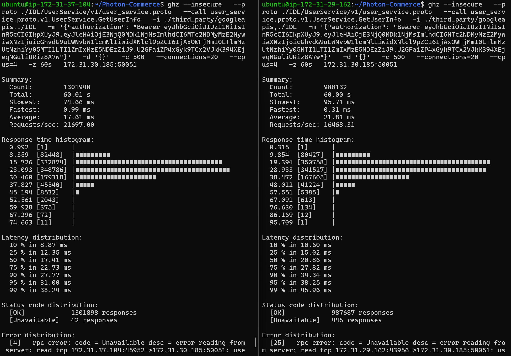
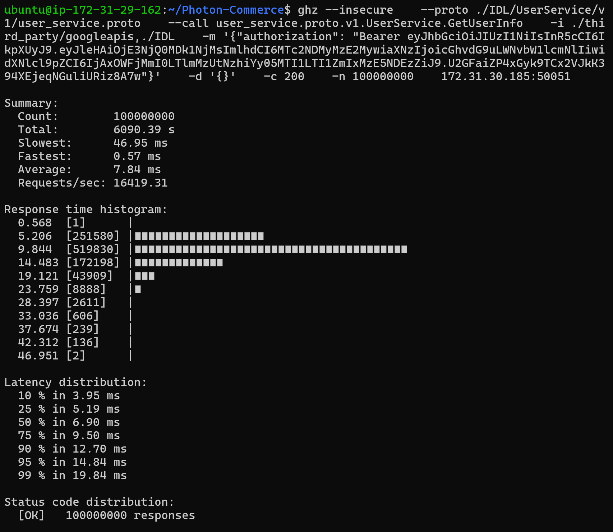
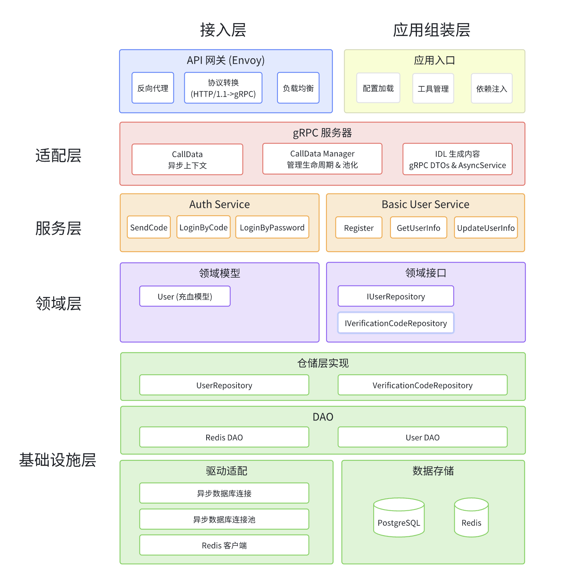
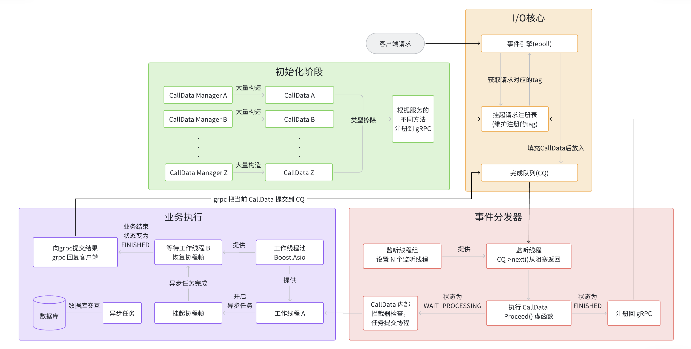
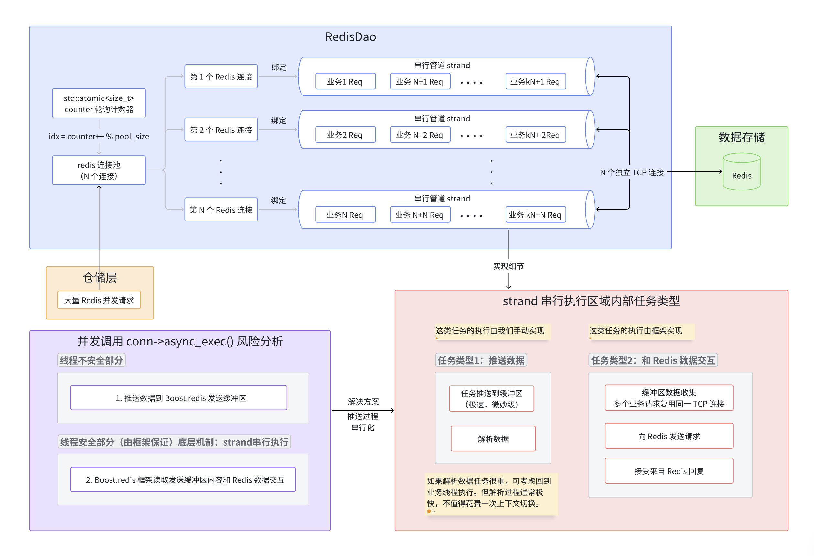
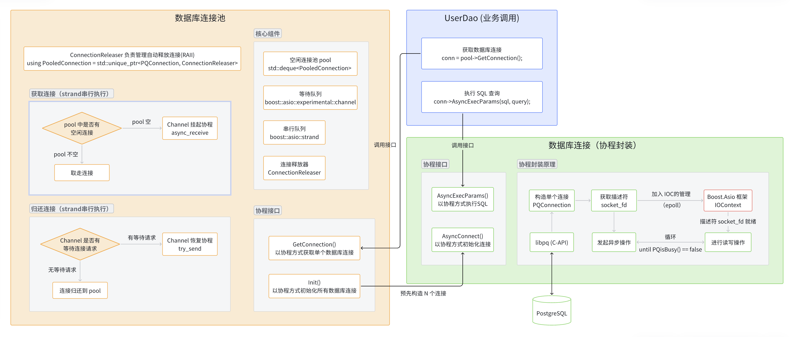
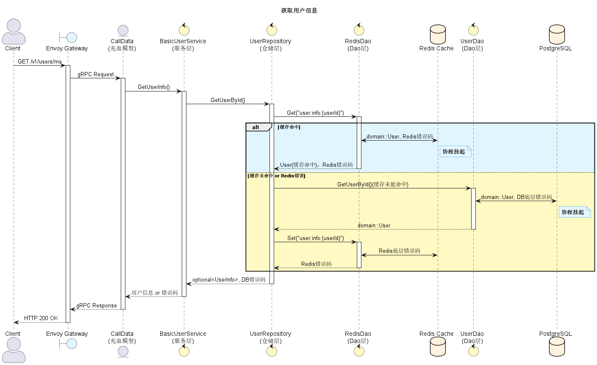

# Photon-Commerce

[**🇺🇸 English**](./README.md) | [**🇨🇳 中文文档**](./README_CN.md)


**Photon-Commerce** 是一个基于 **C++23** 和 **gRPC** 构建的高性能、云原生分布式电商平台引擎。

本项目旨在探索极致的后端性能与架构设计，融合了 **协程**、**零成本抽象**、**无锁编程**、以及 **领域驱动设计** 等先进技术理念。

---


## 🚀 核心特性

### ⚡️️ 极致性能与异步架构

- **全链路异步**：基于 `gRPC 异步模型`与 C++20 协程封装 `libpq` 异步接口，实现了高并发下的低延迟处理，拒绝 I/O 阻塞
- **Strand 无锁并发模型**：利用 `Boost.Asio Strand` 编排异步数据库连接池 (MPMC) 与 Redis 操作。通过处理程序的串行化执行，消除了对显式互斥锁的需求，从而避免了锁竞争。
- **CallData 编译期多态**：设计“`类型擦除`基类 + `CRTP` 模版层 + `Concepts` 约束”的三层架构，实现零虚函数开销的静态多态与业务解耦。
- **对象池化内存管理**：实现了通用的 `Manager` 对象池模板，复用 CallData 实例大幅降低 new/delete 带来的内存碎片。
- **缓存 & 高性能**：集成 Redis `旁路缓存`机制，利用 C++23 expected 取代运行时异常开销，兼顾架构整洁与极致性能
- **零成本抽象**：利用 `Boost.DI` 实现编译器依赖注入与控制反转，在保证代码解耦的同时维持运行时性能

---

## 💪 性能展示

### 性能报告摘要
| 测试类型      | 测试目的      | 测试方法              | 测试结果摘要                |
|:----------|:----------|:------------------|:----------------------|
| **微基准测试** | 测试引擎纯算力上限 | Mock 数据 (无 Redis) | **3.8万 QPS**          |
| **基准测试**  | 测试实战链路表现  | 读写真实 Redis        | **2.3万 ~ 2.5万 QPS**   |
| **长跑测试**  | 测试系统健壮性   | 持续运行 1亿+ 请求       | **1h 41min, 0 Error** |

> 微基准测试 和 基准测试 采用两台施压机同时施压
<details>
<summary>👉 <b>点击展开查看：微基准测试运行截图</b></summary>


</details>


<details>
<summary>👉 <b>点击展开查看：基准测试运行截图</b></summary>


</details>


<details>
<summary>👉 <b>点击展开查看：长跑测试运行截图</b></summary>


</details>


### 🛠️ 测试环境
为了还原真实的生产环境限制，本次测试**并未**使用顶级硬件，而是旨在受限的云原生环境下挖掘架构极限。

| 角色                    | 部署平台            | 实例规格与配置                                  | 说明                       |
|:----------------------|:----------------|:-----------------------------------------|:-------------------------|
| **Server (App)**      | AWS EC2         | **`t3.xlarge`** (4 vCPU, 16GB RAM)       | 运行核心服务 (Ubuntu 24.04)    |
| **Redis (Cache)**     | AWS ElastiCache | **`cache.t3.micro`** (2 vCPU, 0.5GB RAM) | **系统短板**，突发型实例限制了持续高并发能力 |
| **PostgreSQL (DB)**   | AWS RDS         | **`db.t3.micro`** (2 vCPU, 1GB RAM)      | 低配持久化层，仅用于冷数据存储          |
| **Client 1 (Stress)** | AWS EC2         | **`c5.xlarge`** (4 vCPU, 8GB RAM)        | 独立施压机，运行 `ghz`           |
| **Client 2 (Stress)** | AWS EC2         | **`c5.2xlarge`** (8 vCPU, 16GB RAM)      | 独立施压机，运行 `ghz`           |
| **Network**           | AWS VPC         | 同可用区内网                                   | 极低延迟 (< 1ms)，排除公网干扰      |

## 📐 系统架构与核心设计

### 1. 后端服务全链路系统架构图 (Envoy + gRPC + Redis + PostgreSQL)


### 2. 双线程池协作的异步 I/O 处理流程详解
<details>
<summary>👉 <b>点击展开查看详情</b></summary>


</details>


### 3. CallData 模版类实现与请求处理状态流转图
<details>
<summary>👉 <b>点击展开查看详情</b></summary>


</details>


### 4. 基于 Strand 的 Redis 请求串行化机制
<details>
<summary>👉 <b>点击展开查看详情</b></summary>


</details>

### 5. 基于 Strand 与 Channel 的无显示锁数据库连接池设计
<details>
<summary>👉 <b>点击展开查看详情</b></summary>


</details>


### 6. 核心业务逻辑流程图
<details>
<summary>👉 <b>点击展开查看详情</b></summary>


</details>

---

## ⚙️ 技术栈概览

| 维度         | 选型方案                | 核心考量                        |
|:-----------|:--------------------|:----------------------------|
| **开发语言**   | **C++23**           | Coroutines, Expected, Boost |
| **通信协议**   | **gRPC & Protobuf** | 高性能 RPC，异步处理                |
| **API 网关** | **Envoy Proxy**     | 流量治理，REST 转 gRPC            |
| **数据存储**   | **PostgreSQL**      | 关系型数据持久化                    |
| **缓存系统**   | **Redis**           | 热点数据缓存                      |
| **依赖管理**   | **vcpkg & CMake**   | 现代 C++ 包管理与构建系统             |
| **容器化**    | **Docker**          | docker-compose 一键部署         |

### 关键依赖库
| 库名称          | 用途              | 说明                                                       |
|:-------------|:----------------|:---------------------------------------------------------|
| `googleapis` | API Transcoding | 提供 HTTP/JSON 到 gRPC 的映射支持                                |
| `Boost`      | 核心组件            | 包含 `Boost.Asio` (网络/协程调度) 及 `Boost.Redis` (异步 Redis 客户端) |
| `Boost.DI`   | 依赖注入            | 现代 C++ 编译期依赖注入库 (零开销控制反转)                                |
| `libpq`      | 数据库驱动           | PostgreSQL 底层 C 接口，已封装为异步                                |
| `spdlog`     | 日志系统            | 极速 C++ 日志库                                               |
| `cryptopp`   | 安全加密            | 密码哈希与加解密                                                 |
| `jwt-cpp`    | 身份认证            | JSON Web Token 处理                                        |
| `yaml-cpp`   | 配置管理            | YAML 配置文件解析                                              |

---

## ▶️ 快速开始

> 本指南用于帮助在本地快速搭建开发环境。

### 1. 获取源码
**注意**：务必使用 `--recursive` 参数以包含所有子模块。

```bash
# 首次克隆
git clone --recursive git@github.com:seaStarLxy/Photon-Commerce.git

# 若已克隆但缺少子模块
git submodule update --init --recursive
```

### 2. 环境依赖安装
本项目推荐使用 Ubuntu 24.04 环境。

#### 基础工具链
```bash
sudo apt update
sudo apt install -y build-essential pkg-config ninja-build zip unzip tar libssl-dev curl gdb bison flex autoconf automake libtool git net-tools
```

#### C++ 依赖管理 (vcpkg)
使用 vcpkg 管理所有 C++ 第三方库。

```bash
git clone https://github.com/microsoft/vcpkg.git ~/vcpkg
~/vcpkg/bootstrap-vcpkg.sh

# 配置环境变量
echo "" >> ~/.bashrc
echo "# vcpkg config" >> ~/.bashrc
echo "export VCPKG_ROOT=~/vcpkg" >> ~/.bashrc
echo 'export PATH=$VCPKG_ROOT:$PATH' >> ~/.bashrc
source ~/.bashrc
```

### 3. 编译与构建
配置 CMake 时需指定 vcpkg 工具链。

```bash
mkdir build && cd build
cmake .. -DCMAKE_TOOLCHAIN_FILE=~/vcpkg/scripts/buildsystems/vcpkg.cmake
cmake --build .
```

### 4. 服务网关部署 (Envoy)
Envoy 负责将前端 HTTP 请求转发为后端 gRPC 调用。

```bash
# 1. 安装 Envoy (Debian/Ubuntu)
wget -O- https://apt.envoyproxy.io/signing.key | sudo gpg --dearmor -o /etc/apt/keyrings/envoy-keyring.gpg
echo "deb [signed-by=/etc/apt/keyrings/envoy-keyring.gpg] https://apt.envoyproxy.io bookworm main" | sudo tee /etc/apt/sources.list.d/envoy.list
sudo apt-get update && sudo apt-get install envoy

# 检查安装
envoy --version

# 2. 生成 proto.pb (供 Envoy 进行协议转换使用)
# 注意：路径需根据实际环境调整
# 假设当前位于项目根目录
./UserService/cmake-build-debug/vcpkg_installed/x64-linux/tools/protobuf/protoc \
  -I ./IDL \
  -I ./third_party/googleapis \
  --include_imports \
  --descriptor_set_out=./apiGateway/proto.pb \
  ./IDL/UserService/v1/user_service.proto

# 3. 启动 Envoy
envoy -c ./apiGateway/envoy.yaml -l info
```

### 5. 基础设施
请确保已安装并启动以下服务：
1.  **PostgreSQL**: 用于数据持久化
2.  **Redis**: 用于状态管理与缓存
> 本项目使用云原生数据库
---

## 🧭 开发者指南

为保证代码质量与协作效率，项目遵循以下规范。

### 代码命名规范
| 类型 | 风格 | 示例 |
|:---|:---|:---|
| **类/结构体** | PascalCase | `UserSession`, `OrderManager` |
| **函数/方法** | PascalCase | `GetUserInfo()`, `CalculatePrice()` |
| **文件/目录** | snake_case | `user_service.h`, `async_logger.cpp` |
| **变量/参数** | snake_case | `user_id`, `request_timeout` |
| **成员变量** | snake_case + `_` | `db_connection_`, `mutex_` |
| **命名空间** | snake_case | `photon_commerce` |

### Git 工作流
本项目采用 Feature Branch 工作流。

1.  **同步主分支**: `git checkout main && git pull`
2.  **创建分支**:
    * 新功能: `git checkout -b feature/your-feature-name`
    * 修复 Bug: `git checkout -b bugfix/your-fix-name`
    * 重构: `git checkout -b refactor/your-refactor-name`
    * 性能优化: `git checkout -b perf/optimize-connection-pool`
    * 更新文档: `git checkout -b docs/update-readme`
    * 修改构建/配置: `git checkout -b chore/update-cmake`
3.  **提交代码**:
    ```bash
    git add .
    git commit -s -m "feat: implement jwt authentication logic"
    ```
4.  **推送与合并**:
    ```bash
    git push -u origin feature/your-feature-name
    # 随后在 GitHub 发起 Pull Request (PR) 并等待 CI 检查通过
    ```
### ⚠️ 编译器兼容性与已知问题
本项目深度使用了 **C++20/23 协程** 与 **`std::expected`** 错误处理机制。在开发过程中发现，某些版本的 **GCC (尤其是 GCC 13)** 在处理协程返回值隐式转换时存在内部缺陷 (Internal Compiler Error, ICE)。

#### 🔴 GCC "Internal Compiler Error" 问题
若在编译时遇到类似以下的崩溃错误：
```text
internal compiler error: in build_special_member_call, at cp/call.cc:11096
```
这通常是因为在 co_return 语句中进行了多层隐式类型转换（例如：User -> std::optional<User> -> std::expected<...>)，或是将临时对象绑定到了协程的引用参数上。
#### ✅ 解决方案：
1. 避免隐式转换：在 co_return 前，显式构造好最终的返回对象。
2. 避免临时变量绑定引用：调用 co_await 函数时，避免在参数列表中直接创建临时对象（如 std::string 或 std::vector），应提前定义局部变量。


---

## ⚖️ License

本项目采用 [MIT License](./LICENSE) 许可证。